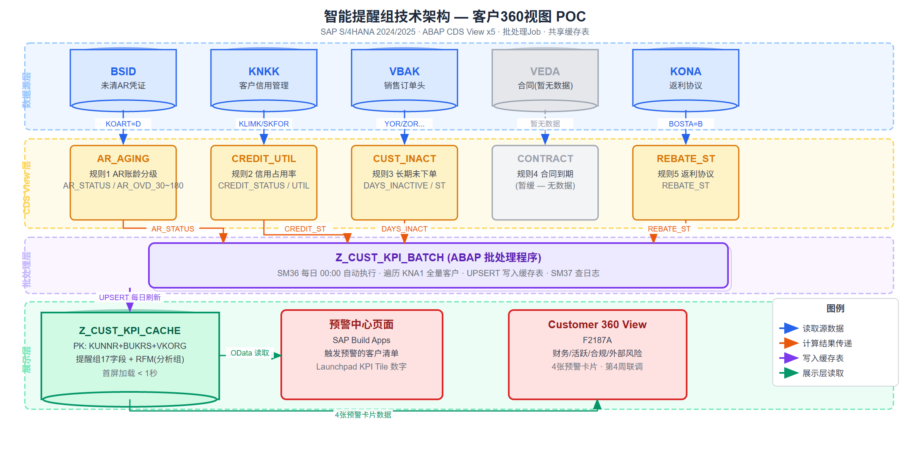
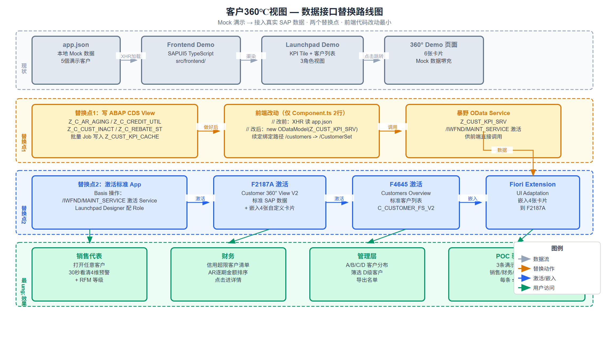

# 客户360视图 POC — 九号公司

> SAP S/4HANA 2024/2025 Private Cloud  
> 目标：给销售、财务、管理层在 SAP 系统里建一个客户全景页面，打开任意客户，30秒内看到4个维度的预警状态与分析数据。

---

## 项目概览

| 项 | 内容 |
|----|------|
| 客户 | 九号公司（Ninebot） |
| 系统 | SAP S/4HANA 2024/2025 Private Cloud |
| 周期 | 4周 POC |
| 状态 | 🟡 进行中（Phase 1） |
| 核心交付 | Customer 360° View — 预警卡片 + 客户价值评分 + Fiori UI |

---

## 两组分工

```
智能提醒组（Smart Alert）          智能分析组（Smart Analysis）
─────────────────────────          ─────────────────────────────
负责"亮红灯"                        负责"分析客户"
5个自动检测规则                      RFM客户评分模型（A/B/C/D）
每日批处理 Job                       6个SAP自带分析页面
写入 Z_CUST_KPI_CACHE  ←────────→  读取缓存表展示 Customer 360° 页面
4张预警卡片数据
```

**共享缓存表：** `Z_CUST_KPI_CACHE`，主键 `MANDT + KUNNR + BUKRS + VKORG`

---

## 智能提醒 — 5大预警规则

| # | 规则 | 触发条件 |
|---|------|----------|
| 1 | AR账龄逾期 | 应收账款超过 30 / 60 / 90 / 180 天分级触发 |
| 2 | 信用额度预警 | 额度占用率超过 70% / 85% / 100% 三档 |
| 3 | 长期未下单 | 超过 60 天无新销售订单 |
| 4 | 合同快到期 | 距到期 15 / 30 / 60 天梯度提醒 |
| 5 | 年度返利协议未签 | 新财年开始后 N 天内未完成协议签署 |

---

## 智能分析 — RFM客户价值评分

| 档位 | 含义 | 运营策略 |
|------|------|----------|
| A | 高价值客户（近期购买 + 频繁 + 金额大） | 强化锁定，签署年框协议 |
| B | 成长型客户 | 加速转化，扩大采购品类 |
| C | 一般活跃客户 | 常规维护 |
| D | 低活跃/流失风险客户 | 专项拜访或挽回策略 |

---

## 技术架构



---

## 数据接口替换路线图

从 Mock 演示接入真实 SAP 数据，共两个替换点，前端代码改动最小：



**替换点1（智能提醒组）：** 写好5个 ABAP CDS View + 批量 Job 后，只需改 `Component.ts` 2行，把 `XHR 读 app.json` 换成 `ODataModel(Z_CUST_KPI_SRV)`。

**替换点2（Basis + 智能分析组）：** 在 `/IWFND/MAINT_SERVICE` 激活 F2187A / F4645 对应 Service，配置 Fiori Launchpad Role，再通过 UI Adaptation 将4张自定义卡片嵌入标准 F2187A。

---

## 4周里程碑

- [ ] **第1周**：开通SAP自带监控页面 + 找样本客户 + 建测试客户
- [ ] **第2周**：写3个CDS View（AR逾期/信用额度/长期未下单）+ 与分析组对齐Z表结构
- [ ] **第3周**：补写2个规则（合同到期/返利未签）+ 写批处理Job + 完成RFM分级
- [ ] **第4周**：联调 + 演示数据准备 + 跑通3条演示路径

---

## 最终验收标准

**销售视角：** 打开任意客户 → 查看逾期金额/逾期天数、最近下单日期、RFM等级、外部风险标签

**财务视角：** 打开财务工作台 → 信用超限客户清单（按逾期金额排序）→ 点击进入客户详情

**管理层视角：** 打开客户列表 → 查看A/B/C/D分布 → 筛选D级客户 → 导出名单

---

## 仓库结构

```
360-view/
├── README.md                         # 本文件：项目总览
├── Index.md                          # 项目总索引（Obsidian 入口）
│
├── src/                              # 所有可运行源码
│   ├── frontend/                     # SAPUI5 前端 Demo
│   │   ├── webapp/
│   │   │   ├── controller/           # 三个页面的控制器逻辑
│   │   │   ├── view/                 # XML 视图（Launchpad/360详情/客户列表）
│   │   │   └── model/app.json        # ⭐ Mock 数据，改这里换演示数据
│   │   ├── package.json
│   │   └── README.md                 # 前端启动说明（含接口改造计划）
│   │
│   ├── abap/                         # ABAP 源码（第2-3周填入）
│   │   ├── cds/                      # CDS View 定义文件
│   │   │   ├── Z_C_AR_AGING_ALERT    # 智能提醒组：AR账龄逾期
│   │   │   ├── Z_C_CREDIT_UTIL       # 智能提醒组：信用额度预警
│   │   │   ├── Z_C_CUST_INACTIVITY   # 智能提醒组：长期未下单
│   │   │   ├── Z_C_CONTRACT_EXPIRY   # 智能提醒组：合同快到期
│   │   │   ├── Z_C_REBATE_UNSIGNED   # 智能提醒组：返利协议未签
│   │   │   └── Z_C_RFM_SCORE         # 智能分析组：RFM评分
│   │   ├── jobs/                     # 批量 Job ABAP 程序
│   │   │   └── Z_CUST_KPI_JOB        # 每日扫描 → 写入 Z_CUST_KPI_CACHE
│   │   └── odata/                    # OData Service 定义
│   │       └── Z_CUST_KPI_SRV        # 前端接口改造后使用
│   │
│   └── scripts/                      # 工具脚本
│       ├── test-data/                # 往SAP测试系统写样本数据的脚本
│       └── deploy/                   # 部署/激活辅助脚本
│
├── 01_业务背景/
│   ├── 业务背景.md                   # 5大预警体系分析 + 业务价值量化
│   └── POC计划.md                    # 4周安排、验收标准、两组分工
├── 02_智能提醒/
│   ├── Smart Alert 技术方案.md       # ⭐ 核心：5个规则/CDS View/批处理/Z表结构
│   └── 用户使用路径.md               # 销售/财务/管理层各自操作路径
├── 03_智能分析/
│   └── Smart Analysis 技术方案.md   # 分析组技术方案（对接参考）
├── 04_UI设计/
│   └── UI设计 v1.0.md               # Fiori Launchpad布局/卡片规格/颜色规范
├── 05_技术方案/
│   ├── 概览.md                       # 技术架构总览
│   ├── 00_数据来源说明.md            # 每个规则读哪张表、哪些字段
│   ├── 01_Z表DDL.md                  # Z_CUST_KPI_CACHE 建表语句
│   ├── 02_CDS_AR账龄逾期.md          # CDS View 代码
│   ├── 03_CDS_信用额度预警.md        # CDS View 代码
│   ├── 04_CDS_长期未下单.md          # CDS View 代码
│   ├── 05_CDS_合同快到期.md          # CDS View 代码
│   ├── 06_CDS_返利协议未签.md        # CDS View 代码
│   └── 07_批处理Job.md               # ABAP 批处理程序
└── 06_测试数据/
    └── 测试数据准备.md               # 6个测试客户建立方法及事务码
```

### src 目录说明

| 目录 | 用途 | 当前状态 | 负责方 |
|------|------|---------|--------|
| `src/frontend/` | SAPUI5 前端 Demo，含 Mock 数据 | ✅ 可运行 | 两组共用 |
| `src/abap/cds/` | 5个预警 + 1个RFM 的 CDS View 源码 | 🔲 第2周填入 | 智能提醒+分析组 |
| `src/abap/jobs/` | 每日批量 Job ABAP 程序 | 🔲 第3周填入 | 智能提醒组 |
| `src/abap/odata/` | 前端接口改造用 OData Service | 🔲 第4周填入 | 智能提醒组 |
| `src/scripts/` | 测试数据 & 部署辅助脚本 | 🔲 按需填入 | 两组共用 |

---

## 技术栈

- **平台：** SAP S/4HANA 2024/2025 Private Cloud
- **开发技术：** ABAP CDS View、ABAP OO（批处理Job）
- **UI框架：** SAP Fiori / SAP Build Work Zone
- **核心对象：** Z_CUST_KPI_CACHE（共享缓存表）、5个CDS View、1个批处理程序
- **文档工具：** Obsidian（本仓库为 Obsidian Vault 导出）

---

## 快速开始（阅读顺序）

1. [Index.md](Index.md) — 项目总览与关键接口约定
2. [01_业务背景/POC计划.md](01_业务背景/POC计划.md) — 了解整体安排
3. [02_智能提醒/Smart Alert 技术方案.md](02_智能提醒/Smart%20Alert%20技术方案.md) — 智能提醒核心文档
4. [05_技术方案/01_Z表DDL.md](05_技术方案/01_Z表DDL.md) — 从建表开始

---

*本仓库由 Obsidian Vault 同步，文档间的 `[[wikilink]]` 为 Obsidian 内部链接格式。*
